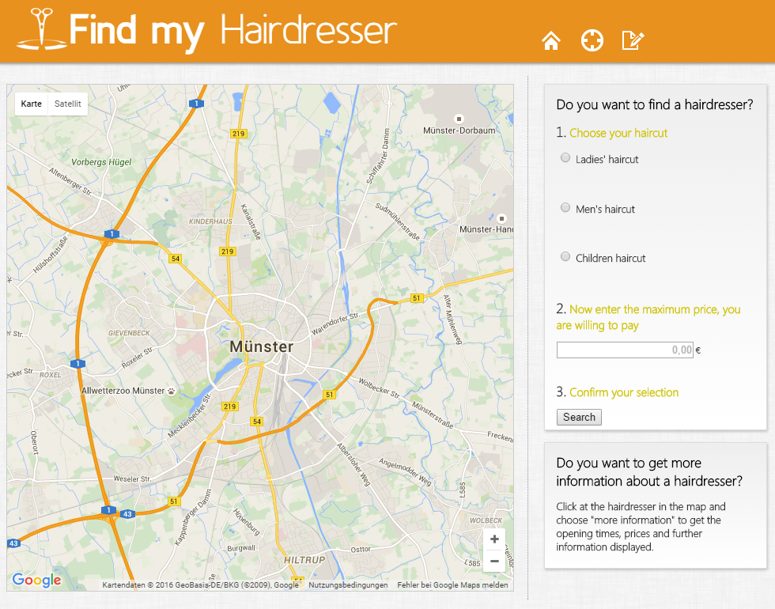

# Find my hairdresser

This project is part of the course *Spatial Information Infrastructure*, which took place at the [Institute for Geoinformatics, Münster](https://www.uni-muenster.de/Geoinformatics/en/index.html) in winter term 2013/14.

This project was voted as the best project by the participants and teachers. The Project allows users to get their nearest hairdressers displayed in a map. They can filter the hairdressers by the price they are willing to pay so that they only get results they are really interested in and they can also get detail information about each hairdresser, e.g. the opening times.
 
## Best Solution Award 2013
### Awarded by Dr. Albert Remke (52°North, Münster)
> The project "Find my hairdresser" was voted as the best project by the participants and teachers in the course "Spatial Information Infrastructure". The project should create web services and a web application for editing and visualizing geospatial data using a crowdsourcing approach. The project "Find my hairdresser" allows users to get their nearest hairdressers displayed in a map. They can filter the hairdressers by the price they are willing to pay so that they only get results they are really interested in and they can also get detail information about each hairdresser, e.g. the opening times.

***

### Contributors

#####  [Marius Runde](https://github.com/mrunde)
#####  [Nicholas Schiestel](https://github.com/nicho90)
#####  [Heinrich Löwen](https://github.com/heinrichloewen)
##### Theresa Franz
##### Sarah Mersch

***

### The MIT License (MIT)

**Copyright (c) 2014 Marius Runde, Nicholas Schiestel, Heinrich Löwen, Theresa Franz, Sarah Mersch**

Permission is hereby granted, free of charge, to any person obtaining a copy
of this software and associated documentation files (the "Software"), to deal
in the Software without restriction, including without limitation the rights
to use, copy, modify, merge, publish, distribute, sublicense, and/or sell
copies of the Software, and to permit persons to whom the Software is
furnished to do so, subject to the following conditions:

The above copyright notice and this permission notice shall be included in all
copies or substantial portions of the Software.

THE SOFTWARE IS PROVIDED "AS IS", WITHOUT WARRANTY OF ANY KIND, EXPRESS OR
IMPLIED, INCLUDING BUT NOT LIMITED TO THE WARRANTIES OF MERCHANTABILITY,
FITNESS FOR A PARTICULAR PURPOSE AND NONINFRINGEMENT. IN NO EVENT SHALL THE
AUTHORS OR COPYRIGHT HOLDERS BE LIABLE FOR ANY CLAIM, DAMAGES OR OTHER
LIABILITY, WHETHER IN AN ACTION OF CONTRACT, TORT OR OTHERWISE, ARISING FROM,
OUT OF OR IN CONNECTION WITH THE SOFTWARE OR THE USE OR OTHER DEALINGS IN THE
SOFTWARE.
